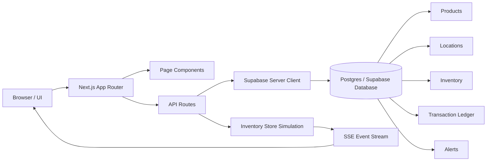

# StockFlow — Intelligent Inventory Management System

A real-time Inventory Management System (IMS) built with Next.js that empowers businesses to track stock across multiple locations, predict replenishment needs, prevent shrinkage, and optimize supply chain efficiency.

## Features

- **Multi-Location Tracking** — Monitor inventory across warehouses, distribution centers, and retail stores
- **Real-Time Updates** — Server-Sent Events (SSE) for live stock changes, alerts, and metrics
- **Predictive Replenishment** — AI-driven velocity analysis with days-until-stockout and order quantity recommendations
- **Shrinkage Detection** — Automatic variance detection between expected and actual counts
- **Supply Chain Insights** — Optimization recommendations for transfers, order consolidation, and safety stock
- **Interactive Dashboard** — KPIs, trend charts, category distribution, and location utilization

## Tech Stack

- **Next.js 16** (App Router)
- **React 19** + TypeScript
- **Tailwind CSS 4**
- **Recharts** for data visualization
- **Radix UI** primitives for accessible components

## Getting Started

```bash
npm install
npm run dev
```

Open [http://localhost:3000](http://localhost:3000) in your browser.

## Pages

| Route | Description |
|-------|-------------|
| `/` | Dashboard with KPIs, charts, and live alerts |
| `/inventory` | Searchable inventory table with location breakdown |
| `/locations` | Multi-location cards with utilization metrics |
| `/analytics` | Replenishment predictions and shrinkage analysis |
| `/alerts` | Real-time alert management |

## API Routes

| Endpoint | Method | Description |
|----------|--------|-------------|
| `/api/inventory` | GET, POST | List/filter inventory, transfer & adjust stock |
| `/api/analytics` | GET | Dashboard metrics, trends, predictions |
| `/api/alerts` | GET, PATCH | List alerts, acknowledge alerts |
| `/api/locations` | GET | Location utilization and analytics |
| `/api/events` | GET (SSE) | Real-time event stream |

## Architecture



### Architecture Overview

- The frontend is a React/Next.js application with route-based pages and reusable UI components.
- API routes handle reads, writes, and operational actions such as stock adjustment and inventory transfer.
- Supabase provides the persistent relational data layer for products, locations, inventory, transactions, and alerts.
- The in-memory inventory store simulates live stock movement and emits real-time events through an SSE endpoint for the dashboard experience.
- A setup script provisions tables and seeds example data so the app can boot quickly in a local or demo environment.

### Project Structure

```text
src/
├── app/                  # Next.js pages and API routes
├── components/           # UI and feature components
│   ├── dashboard/        # Charts, KPIs, alerts, predictions
│   ├── inventory/        # Inventory table and stock actions
│   ├── layout/           # Sidebar, header, app shell
│   └── ui/               # Reusable UI primitives
├── hooks/                # SWR hooks for API consumption
└── lib/
    ├── data/             # Seed data
    ├── engine/           # Prediction and shrinkage logic
    ├── store/            # In-memory realtime simulation store
    └── types.ts          # Shared TypeScript interfaces
```

## Production Considerations

- Replace in-memory store with a persistent database
- Add authentication (NextAuth.js) and role-based access
- Connect to ERP/WMS systems via webhooks
- Deploy SSE via Redis pub/sub for multi-instance scaling
- Add barcode scanning and mobile PWA support
